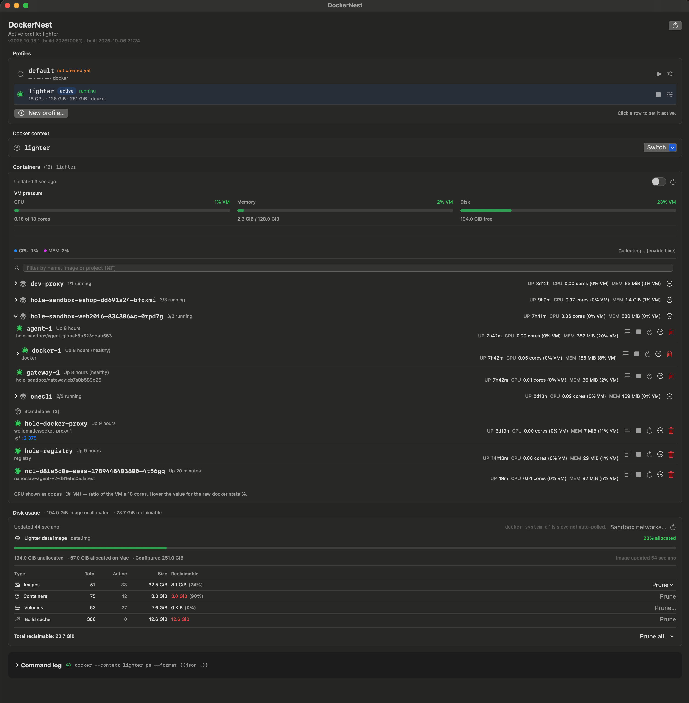

# Homebrew Tap

Homebrew tap for Petr Filip tools and macOS apps.

## DockerNest

Native macOS GUI for Docker containers and runtimes, including
[Lighter](https://github.com/fieldwork-ai/lighter) and
[Colima](https://github.com/abiosoft/colima).



### Install and launch

Requires macOS 14 or later, Homebrew, and Apple Command Line Tools (or Xcode). Homebrew downloads
verified source archives and builds the app locally. No Apple Developer Program
membership is required. The first installation can take several minutes.

```bash
brew install petrfilip/tap/dockernest
dockernest
```

Choose a runtime and install its tools separately:

**[Lighter](https://github.com/fieldwork-ai/lighter)** — requires Apple Silicon and macOS 15 or later.

```bash
brew tap fieldwork-ai/tap
brew install lighter docker docker-compose
```

**[Colima](https://github.com/abiosoft/colima)**:

```bash
brew install colima docker docker-compose
```

DockerNest is automatically installed in `/Applications` and is available in
Finder, Spotlight, and Launchpad. No manual link or extra installation step is needed.

### Update and uninstall

```bash
brew update
brew upgrade dockernest
brew uninstall dockernest
```

Uninstalling removes the application and its launcher. Homebrew also removes its build sources.

If you installed the older formula, `brew update` recognizes the migration to a
cask. Remove the old formula when prompted by Homebrew.

### Releases

Versioned source archives and their SHA-256 checksums are published in this
repository's [GitHub Releases](https://github.com/petrfilip/homebrew-tap/releases).
The cask pins its source archive by checksum, including the verified SwiftTerm
library sources. The app is built and ad-hoc signed on the installing computer.
No additional Swift packages are downloaded during installation.

DockerNest is licensed under MIT; the source archive includes its license.
